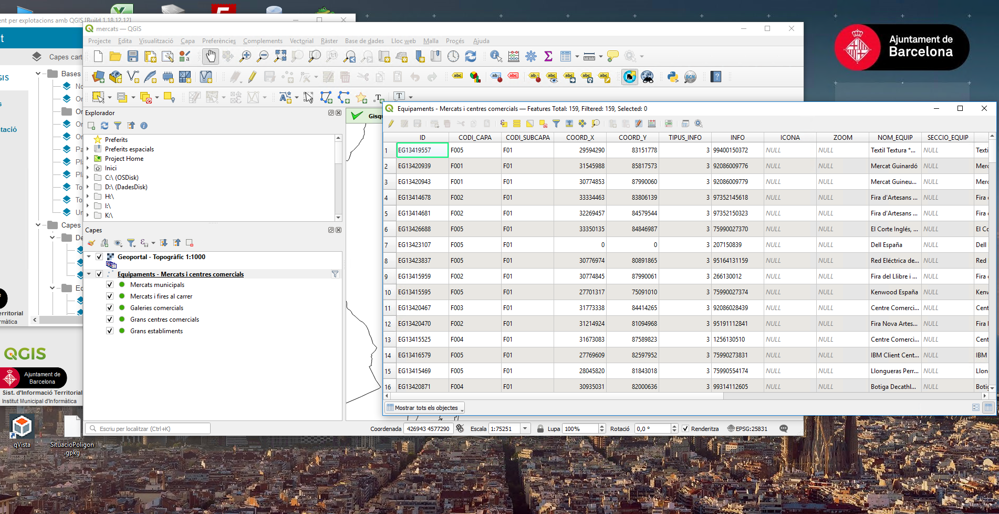

# Pla de Proves - Cerca Específica en Capes Vectorials

## 1. Informació General

### 1.1 Objectiu
Validar el correcte funcionament de la funcionalitat de cerca específica en capes vectorials, incloent la identificació automàtica de capes amb variables `qV_search`, el canvi de mode de cerca, i la funcionalitat de cerca, selecció i zoom en features.

### 1.2 Abast
- Front-end: Component SearchTool modificat
- Back-end: Modificacions en el servidor Golang per incorporar variables QGIS
- Integració: Comunicació entre front-end i back-end
- Experiència d'usuari: Interfície i flux de treball

### 1.3 Criteris d'Acceptació Generals
- La cerca específica s'activa automàticament quan existeixen capes amb variable `qV_search`
- El selector permet canviar entre cerca normal i específica
- La cerca funciona correctament en capes vectorials locals
- S'activen automàticament les capes desactivades quan es cerca en elles
- El zoom i ressaltat de features funciona correctament

## 2. Casos de Prova - Front-End

### 2.1 Identificació de Variables qV_search

#### TC-FE-001: Detecció de variable qV_search vàlida
**Descripció:** Verificar que el component detecta correctament una variable qV_search amb sintaxi vàlida
**Precondicions:** 
- Projecte amb almenys una capa que contingui variable `qV_search='field="CODI" fieldtext="Codi" desc="introduïu codi"'`
**Passos:**
1. Carregar projecte amb capa que conté variable qV_search
2. Observar el component SearchTool
**Resultat esperat:** 
- El selector de tipus de cerca apareix automàticament
- Es detecta la cerca específica disponible
**Resultat obtingut:**
```
___ ESCRIU AQUÍ EL RESULTAT DE L'EXECUCIÓ ___

```
**Estat:** ☐ PASS ☐ FAIL ☐ PENDING

#### TC-FE-002: Múltiples capes amb qV_search
**Descripció:** Verificar comportament amb múltiples capes que contenen variables qV_search
**Precondicions:** 
- Projecte amb 2+ capes que contenen diferents variables qV_search
**Passos:**
1. Carregar projecte amb múltiples capes amb qV_search
2. Verificar el selector de cerques
**Resultat esperat:** 
- Totes les cerques específiques apareixen en el selector
- Cada cerca mostra el fieldtext corresponent
**Resultat obtingut:**
```
___ ESCRIU AQUÍ EL RESULTAT DE L'EXECUCIÓ ___
```
**Estat:** ☐ PASS ☐ FAIL ☐ PENDING

#### TC-FE-003: Variable qV_search amb sintaxi incorrecta
**Descripció:** Verificar que variables mal formatejades no activen la cerca específica
**Precondicions:** 
- Capa amb variable `qV_search` mal formatejada (ex: sense quotes, camps mancants)
**Passos:**
1. Carregar projecte amb variable qV_search incorrecta
2. Verificar comportament del SearchTool
**Resultat esperat:** 
- No s'activa la cerca específica
- Només apareix la cerca normal
- No es mostren errors a l'usuari
**Resultat obtingut:**
```
___ ESCRIU AQUÍ EL RESULTAT DE L'EXECUCIÓ ___
```
**Estat:** ☐ PASS ☐ FAIL ☐ PENDING

### 2.2 Interfície d'Usuari

#### TC-FE-004: Selector de mode de cerca
**Descripció:** Verificar funcionament del selector entre cerca normal i específica
**Precondicions:** 
- Projecte amb cerca específica disponible
**Passos:**
1. Obrir projecte amb cerques específiques
2. Verificar que apareix el selector
3. Canviar entre "Cerca Normal" i cerques específiques
4. Verificar canvi de placeholder en el camp de cerca
**Resultat esperat:** 
- Selector funciona correctament
- Placeholder canvia segons el tipus seleccionat
- El camp desc de qV_search es mostra com placeholder
**Resultat obtingut:**
```
___ ESCRIU AQUÍ EL RESULTAT DE L'EXECUCIÓ ___
```
**Estat:** ☐ PASS ☐ FAIL ☐ PENDING

#### TC-FE-005: Estat inicial del selector
**Descripció:** Verificar l'estat per defecte del selector de cerca
**Precondicions:** 
- Projecte amb cerca específica disponible
**Passos:**
1. Carregar projecte
2. Observar estat inicial del selector
**Resultat esperat:** 
- Selector inicia en "Cerca Normal"
- Placeholder mostra text de cerca normal
**Resultat obtingut:**
```
___ ESCRIU AQUÍ EL RESULTAT DE L'EXECUCIÓ ___
```
**Estat:** ☐ PASS ☐ FAIL ☐ PENDING

### 2.3 Funcionalitat de Cerca Específica

#### TC-FE-006: Cerca amb mínim de caràcters
**Descripció:** Verificar que la cerca requereix mínim 2-3 caràcters
**Precondicions:** 
- Cerca específica seleccionada
- Capa amb dades de prova
**Passos:**
1. Seleccionar cerca específica
2. Escriure 1 caràcter
3. Escriure 2 caràcters
4. Escriure 3+ caràcters
**Resultat esperat:** 
- Amb 1 caràcter: No apareixen suggeriments
- Amb 2+ caràcters: Apareixen suggeriments rellevants
**Resultat obtingut:**
```
___ ESCRIU AQUÍ EL RESULTAT DE L'EXECUCIÓ ___
```
**Estat:** ☐ PASS ☐ FAIL ☐ PENDING

#### TC-FE-007: Cerca per substring
**Descripció:** Verificar que la cerca funciona per coincidència de substring
**Precondicions:** 
- Capa amb dades de prova conegudes (ex: "CODI001", "CODI002", "ALTRE001")
**Passos:**
1. Buscar "CODI" (ha de trobar CODI001, CODI002)
2. Buscar "001" (ha de trobar CODI001, ALTRE001)
3. Buscar "XYZ" (no ha de trobar res)
**Resultat esperat:** 
- Resultats mostren totes les coincidències per substring
- Cerques sense resultats mostren llista buida
**Resultat obtingut:**
```
___ ESCRIU AQUÍ EL RESULTAT DE L'EXECUCIÓ ___
```
**Estat:** ☐ PASS ☐ FAIL ☐ PENDING

#### TC-FE-008: Selecció de suggeriment única
**Descripció:** Verificar que només es pot seleccionar un suggeriment
**Precondicions:** 
- Cerca amb múltiples resultats
**Passos:**
1. Realitzar cerca que retorni múltiples resultats
2. Intentar seleccionar un suggeriment
3. Verificar comportament
**Resultat esperat:** 
- Només es pot seleccionar un suggeriment
- En seleccionar, es tanca la llista de suggeriments
**Resultat obtingut:**
```
___ ESCRIU AQUÍ EL RESULTAT DE L'EXECUCIÓ ___
```
**Estat:** ☐ PASS ☐ FAIL ☐ PENDING

### 2.4 Zoom i Ressaltat

#### TC-FE-009: Zoom a feature seleccionada
**Descripció:** Verificar que en seleccionar un suggeriment es fa zoom a la feature
**Precondicions:** 
- Feature amb geometria coneguda a la capa
**Passos:**
1. Realitzar cerca específica
2. Seleccionar un suggeriment
3. Verificar zoom del mapa
**Resultat esperat:** 
- El mapa fa zoom a la geometria de la feature seleccionada
- La feature queda centrada i visible
**Resultat obtingut:**
```
___ ESCRIU AQUÍ EL RESULTAT DE L'EXECUCIÓ ___
```
**Estat:** ☐ PASS ☐ FAIL ☐ PENDING

#### TC-FE-010: Ressaltat de feature
**Descripció:** Verificar que la feature seleccionada es ressalta visualment
**Precondicions:** 
- Feature seleccionada mitjançant cerca
**Passos:**
1. Seleccionar feature mitjançant cerca
2. Verificar ressaltat visual
**Resultat esperat:** 
- La feature es ressalta amb estil diferenciat
- El ressaltat és clarament visible
**Resultat obtingut:**
```
___ ESCRIU AQUÍ EL RESULTAT DE L'EXECUCIÓ ___
```
**Estat:** ☐ PASS ☐ FAIL ☐ PENDING

### 2.5 Activació Automàtica de Capes

#### TC-FE-011: Activació de capa desactivada
**Descripció:** Verificar que s'activa automàticament una capa desactivada en cercar en ella
**Precondicions:** 
- Capa amb qV_search desactivada
**Passos:**
1. Verificar que la capa està desactivada
2. Seleccionar cerca específica d'aquesta capa
3. Realitzar cerca
**Resultat esperat:** 
- La capa s'activa automàticament
- La cerca funciona normalment
- La capa roman activada després de la cerca
**Resultat obtingut:**
```
___ ESCRIU AQUÍ EL RESULTAT DE L'EXECUCIÓ ___
```
**Estat:** ☐ PASS ☐ FAIL ☐ PENDING

## 3. Casos de Prova - Back-End

### 3.1 Processament de Variables QGIS

#### TC-BE-001: Lectura de variable qV_search des de QGS
**Descripció:** Verificar que el servidor llegeix correctament les variables qV_search de l'arxiu .qgs
**Precondicions:** 
- Arxiu .qgs amb variables qV_search configurades
**Passos:**
1. Pujar projecte QGIS amb variables qV_search
2. Verificar project.json generat
**Resultat esperat:** 
- Les variables qV_search apareixen a project.json
- La sintaxi es preserva correctament
**Resultat obtingut:**
```
___ ESCRIU AQUÍ EL RESULTAT DE L'EXECUCIÓ ___
```
**Estat:** ☐ PASS ☐ FAIL ☐ PENDING

#### TC-BE-002: Actualització de project.json
**Descripció:** Verificar que les modificacions en .qgs es reflecteixen a project.json
**Precondicions:** 
- Projecte existent al servidor
**Passos:**
1. Modificar variables qV_search a QGIS
2. Actualitzar projecte al servidor
3. Verificar project.json actualitzat
**Resultat esperat:** 
- Els canvis es reflecteixen a project.json
- Variables antigues s'eliminen si ja no existeixen
**Resultat obtingut:**
```
___ ESCRIU AQUÍ EL RESULTAT DE L'EXECUCIÓ ___
```
**Estat:** ☐ PASS ☐ FAIL ☐ PENDING

### 3.2 Estructura JSON

#### TC-BE-003: Format de variables en JSON
**Descripció:** Verificar el format correcte de les variables qV_search a project.json
**Precondicions:** 
- Projecte amb variables qV_search configurades
**Passos:**
1. Examinar project.json generat
2. Verificar estructura de variables qV_search
**Resultat esperat:** 
- Variables estan a la secció correcta del JSON
- Estructura és consistent i parsejable
**Resultat obtingut:**
```
___ ESCRIU AQUÍ EL RESULTAT DE L'EXECUCIÓ ___
```
**Estat:** ☐ PASS ☐ FAIL ☐ PENDING

## 4. Casos de Prova - Integració

### 4.1 Comunicació Front-End - Back-End

#### TC-INT-001: Càrrega de configuració de cerca
**Descripció:** Verificar que el front-end rep correctament la configuració de cerques específiques
**Passos:**
1. Carregar projecte amb cerques específiques
2. Verificar crides de xarxa
3. Verificar dades rebudes al front-end
**Resultat esperat:** 
- La configuració es carrega correctament
- No hi ha errors de comunicació
**Resultat obtingut:**
```
___ ESCRIU AQUÍ EL RESULTAT DE L'EXECUCIÓ ___
```
**Estat:** ☐ PASS ☐ FAIL ☐ PENDING

### 4.2 Rendiment

#### TC-INT-002: Rendiment amb volums grans
**Descripció:** Verificar rendiment de cerca amb capes que contenen moltes features
**Precondicions:** 
- Capa amb 1000+ features
**Passos:**
1. Carregar projecte amb capa gran
2. Realitzar cerques específiques
3. Mesurar temps de resposta
**Resultat esperat:** 
- Cerques responen en < 1 segon
- Interfície no es bloqueja durant cerca
**Resultat obtingut:**
```
___ ESCRIU AQUÍ EL RESULTAT DE L'EXECUCIÓ ___
```
**Estat:** ☐ PASS ☐ FAIL ☐ PENDING

## 5. Casos de Prova - Regressió

### 5.1 Funcionalitat Existent

#### TC-REG-001: Cerca normal no afectada
**Descripció:** Verificar que la cerca normal segueix funcionant correctament
**Passos:**
1. Realitzar cerques normals (Barcelona)
2. Verificar funcionament complet
**Resultat esperat:** 
- Cerca normal funciona sense canvis
- No hi ha regressions en funcionalitat existent
**Resultat obtingut:**
```
___ ESCRIU AQUÍ EL RESULTAT DE L'EXECUCIÓ ___
```
**Estat:** ☐ PASS ☐ FAIL ☐ PENDING

#### TC-REG-002: Projectes sense cerca específica
**Descripció:** Verificar comportament amb projectes que no tenen variables qV_search
**Passos:**
1. Carregar projecte sense variables qV_search
2. Verificar interfície de cerca
**Resultat esperat:** 
- Només apareix cerca normal
- No hi ha canvis visibles en la interfície
- No es mostren errors
**Resultat obtingut:**
```
___ ESCRIU AQUÍ EL RESULTAT DE L'EXECUCIÓ ___
```
**Estat:** ☐ PASS ☐ FAIL ☐ PENDING

## 6. Casos de Prova - Edge Cases

### 6.1 Dades Especials

#### TC-EDGE-001: Caràcters especials en camps
**Descripció:** Verificar cerca amb caràcters especials (accents, ñ, etc.)
**Precondicions:** 
- Dades amb caràcters especials al camp de cerca
**Passos:**
1. Buscar text amb accents
2. Buscar text amb ñ
3. Buscar text amb símbols especials
**Resultat esperat:** 
- La cerca maneja correctament caràcters especials
- Coincidències són exactes
**Resultat obtingut:**
```
___ ESCRIU AQUÍ EL RESULTAT DE L'EXECUCIÓ ___
```
**Estat:** ☐ PASS ☐ FAIL ☐ PENDING

#### TC-EDGE-002: Camps buits o nuls
**Descripció:** Verificar comportament amb valors buits al camp de cerca
**Precondicions:** 
- Features amb valors null o buits al camp qV_search
**Passos:**
1. Realitzar cerca en capa amb valors buits
2. Verificar resultats
**Resultat esperat:** 
- No s'inclouen features amb valors buits/null
- No es produeixen errors
**Resultat obtingut:**
```
___ ESCRIU AQUÍ EL RESULTAT DE L'EXECUCIÓ ___
```
**Estat:** ☐ PASS ☐ FAIL ☐ PENDING

### 6.2 Configuració Errònia

#### TC-EDGE-003: Camp inexistent en qV_search
**Descripció:** Verificar comportament quan qV_search referencia un camp que no existeix
**Precondicions:** 
- Variable qV_search amb field que no existeix a la capa
**Passos:**
1. Carregar projecte amb configuració errònia
2. Intentar usar cerca específica
**Resultat esperat:** 
- Es maneja l'error amb gracia
- Es mostra missatge d'error o es desactiva la cerca
- No es produeix crash de l'aplicació
**Resultat obtingut:**
```
___ ESCRIU AQUÍ EL RESULTAT DE L'EXECUCIÓ ___
```
**Estat:** ☐ PASS ☐ FAIL ☐ PENDING

## 7. Matriu de Compatibilitat

### 7.1 Navegadors
- [ ] Chrome (última versió) - **Resultat:** _______________
- [ ] Firefox (última versió) - **Resultat:** _______________
- [ ] Safari (última versió) - **Resultat:** _______________
- [ ] Edge (última versió) - **Resultat:** _______________

### 7.2 Dispositius
- [ ] Desktop (Windows/Mac/Linux) - **Resultat:** _______________
- [ ] Tablet - **Resultat:** _______________
- [ ] Mòbil - **Resultat:** _______________

## 8. Criteris de Finalització

### 8.1 Criteris de Pas
- Tots els casos de prova TC-FE-* passen exitosament
- Tots els casos de prova TC-BE-* passen exitosament
- Almenys 95% de casos TC-INT-* i TC-REG-* passen
- No hi ha regressions crítiques en funcionalitat existent

### 8.2 Criteris de Fallada
- Qualsevol cas de prova crític (marcat com tal) falla
- Es detecten regressions en funcionalitat de cerca normal
- Rendiment es degrada significativament (>50% més lent)

## 9. Entorn de Proves

### 9.1 Dades de Prova Requerides
- Projecte QGIS amb almenys 3 capes vectorials
- Una capa amb variable qV_search vàlida
- Una capa amb variable qV_search invàlida
- Una capa sense variable qV_search
- Dades amb caràcters especials
- Capa amb 1000+ features per proves de rendiment

### 9.2 Configuració d'Entorn
- Servidor d'integració configurat
- Base de dades amb dades de prova
- Projecte QGIS de prova preparat i desplegat

**Estat de preparació de l'entorn:**
```
___ ESCRIU AQUÍ L'ESTAT DE PREPARACIÓ ___
```

## 10. Responsabilitats

### 10.1 Preparació de Dades
- **Responsable:** Equip de desenvolupament
- **Entregables:** Projectes QGIS de prova, dades de prova
- **Estat:** _______________

### 10.2 Execució de Proves
- **Responsable:** Equip QA / Desenvolupador
- **Cronograma:** Després d'implementació completa
- **Estat:** _______________

### 10.3 Informe de Resultats
- **Format:** Document amb estat de cada cas de prova
- **Entrega:** En completar totes les proves
- **Data d'execució:** _______________
- **Responsable execució:** _______________

## 11. Resum d'Execució

### 11.1 Estadístiques Generals
- **Data d'inici:** _______________
- **Data de finalització:** _______________
- **Total casos de prova:** 20
- **Casos passats:** _______________
- **Casos fallats:** _______________
- **Casos pendents:** _______________
- **Percentatge d'èxit:** _______________%

### 11.2 Observacions Generals
```
___ ESCRIU AQUÍ OBSERVACIONS GENERALS SOBRE L'EXECUCIÓ ___
```

### 11.3 Problemes Trobats
```
___ LLISTA AQUÍ ELS PROBLEMES TROBATS DURANT LES PROVES ___
```

### 11.4 Recomanacions
```
___ ESCRIU AQUÍ RECOMANACIONS PER MILLORAR LA FUNCIONALITAT ___
```
