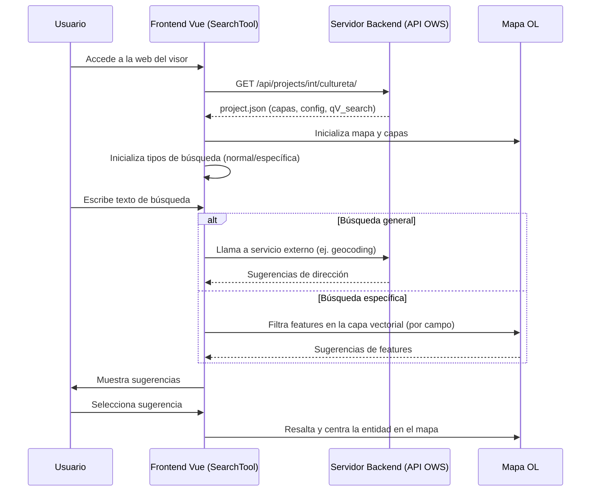
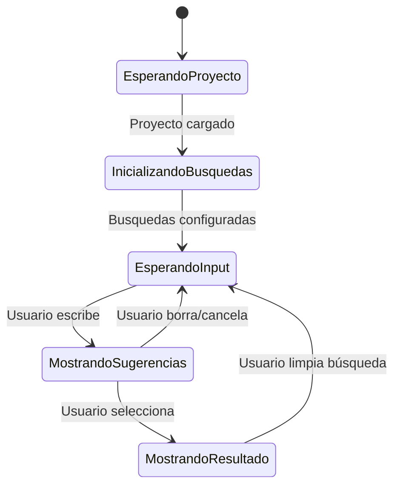

Aquí tienes un **diseño técnico completo** del componente SearchTool.vue y su interacción con el servidor y el flujo de carga del mapa, pensado tanto para el equipo de desarrollo como para documentación de cliente.

---

# 📄 Diseño Técnico: Componente SearchTool.vue y Flujo de Carga de Mapa

## 1. **Visión General**

El componente SearchTool.vue es el buscador avanzado del visor GIS. Permite búsquedas generales (por dirección) y específicas (por atributos de capas vectoriales). Se integra con el estado global del proyecto y con el mapa, mostrando sugerencias y permitiendo seleccionar y resaltar entidades.

---

## 2. **Estructura y Responsabilidades**

- **Inicialización**: Detecta cuándo el proyecto y las capas están disponibles y configura los tipos de búsqueda.
- **Búsqueda general**: Usa servicios externos (ej. Barcelona) para geocodificación.
- **Búsqueda específica**: Permite buscar por campos configurados en cada capa vectorial.
- **Interacción con el mapa**: Resalta y centra la vista en la entidad seleccionada.
- **Gestión de errores y estados**: Muestra mensajes de error y loading.

---

## 3. **Flujo de Carga de Mapa y Búsqueda**

### **3.1 Diagrama de Actividades (Mermaid)**

```mermaid
flowchart TD
    A[Usuario accede a la URL del visor] --> B[Frontend solicita project.json al backend]
    B --> C[Backend responde con la configuración del proyecto]
    C --> D[Frontend inicializa el mapa y las capas]
    D --> E[SearchTool.vue observa el estado del proyecto]
    E --> F{¿Capas vectoriales con búsqueda específica?}
    F -- Sí --> G[Configura tipos de búsqueda y placeholders]
    F -- No --> H[Configura solo búsqueda general]
    G & H --> I[Usuario interactúa con el buscador]
    I --> J{¿Búsqueda general o específica?}
    J -- General --> K[Llama a servicio externo (ej. Barcelona)]
    J -- Específica --> L[Filtra features en la capa vectorial]
    K & L --> M[Muestra sugerencias y permite seleccionar entidad]
    M --> N[Resalta y centra la entidad en el mapa]
```

---

### **3.2 Diagrama de Secuencia (Mermaid)**



---

## 4. **Estados del Componente**



---

## 5. **Interacción con el Servidor**

- **Carga inicial**:  
  - `GET /api/projects/int/cultureta/` → project.json (estructura de capas, campos de búsqueda, etc.)
- **Búsqueda general**:  
  - Llamadas a servicios externos (ej. geocoding de Barcelona)
- **Búsqueda específica**:  
  - No realiza llamadas directas al backend para sugerencias, sino que filtra los features ya cargados en el frontend.
- **Selección de entidad**:  
  - Resalta la feature en el mapa y centra la vista.

---

## 6. **Ejemplo de Configuración de Capa (JSON)**

```json
{
  "title": "Equipaments - Cultura i lleure",
  "name": "Equipaments - Cultura i lleure",
  "qgis_id": "Equipaments___Cultura_i_lleure_9f8826e5_2b63_40dd_969b_619120f559fe",
  "qV_search": "field=\"NOM_EQUIP\" fieldText=\"Nom\"",
  ...
}
```

---

## 7. **Ejemplo de Petición WMS/WFS**

```http
GET http://localhost:82/api/map/ows/int/cultureta?SERVICE=WMS&VERSION=1.3.0&REQUEST=GetMap&LAYERS=Equipaments - Cultura i lleure&...
```
**Respuesta esperada:** Imagen del mapa con la capa solicitada  
**Respuesta de error actual:**  
```xml
<ServiceException code="LayerNotDefined">The layer 'Equipaments - Cultura i lleure' does not exist.</ServiceException>
```

---

## 8. **Notas y Consideraciones**

- El nombre de la capa en el JSON debe coincidir exactamente con el nombre interno publicado por el backend.
- El componente es reactivo: observa cambios en el proyecto y en las capas para reconfigurar las búsquedas automáticamente.
- El filtrado de features para la búsqueda específica se realiza en el frontend, sobre las features ya cargadas.
- Los logs en consola ayudan a depurar el flujo de carga y la configuración de búsquedas.

---

## 9. **Referencias y Documentación Relacionada**

- #report_errada_carrega_taulaatributs.md
- [#localhost_Archive [25-06-24 11-23-59].har](localhost_Archive%20%5B25-06-24%2011-23-59%5D.har)
- #FeaturesTable.vue
- #SearchTool.vue

---

¿Necesitas que amplíe algún apartado o que detalle la interacción con otros componentes?