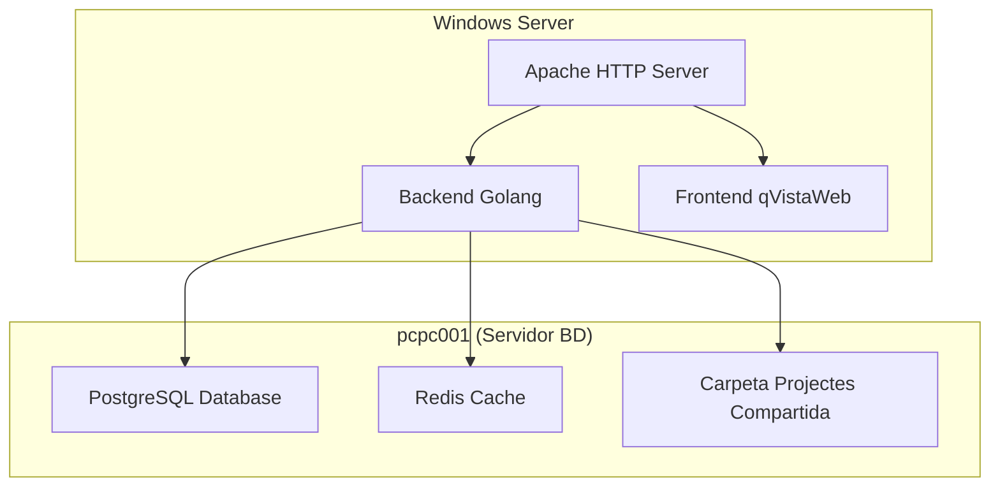

# Manual d'Instal·lació i Configuració - Gisquick-QVista per Windows Server

**Document:** Manual d'Instal·lació Backend Windows Server  
**Projecte:** Gisquick-QVista  
**Data:** 6 de juny de 2025  
**Versió:** 1.0

---

## 📋 Índex

1. Visió General de l'Arquitectura
2. Requisits del Sistema
3. Instal·lació del Backend (Golang)
4. Configuració d'Apache
5. Configuració de Base de Dades PostgreSQL
6. Configuració de Redis
7. Configuració de Carpeta Compartida de Projectes
8. Testing i Verificació

---

## 1. Visió General de l'Arquitectura

### 1.1 Components del Sistema



### 1.2 Distribució de Serveis per Entorn

| Component | Producció | Preproducció | Integració |
|-----------|-----------|--------------|------------|
| **Backend Go** | Port personalitzat | Port personalitzat | Port personalitzat |
| **Apache** | Port personalitzat | Port personalitzat | Port personalitzat |
| **Redis DB** | 0 | 1 | 2 |
| **Projectes** | P:\publish\prod | P:\publish\pre | P:\publish\int |

> **Nota:** Els ports d'Apache s'assignaran segons disponibilitat (no necessàriament 80, 81, 82)

---

## 2. Requisits del Sistema

### 2.1 Windows Server (Backend + Apache + Frontend)

**Especificacions mínimes:**
- **SO:** Windows Server 2019 o 2022
- **RAM:** 16 GB
- **CPU:** 8 cores
- **Disc:** 200 GB SSD
- **Xarxa:** Connectivitat amb pcpc001

**Software requerit:**
- Apache 2.4+ per Windows (ja instal·lat)
- Go 1.19+ per Windows
- NSSM (Non-Sucking Service Manager) per serveis
- Node.js 16+ per Windows (per build del frontend)

### 2.2 pcpc001 (Base de Dades i Emmagatzematge)

**Software requerit:**
- PostgreSQL 13+ (ja instal·lat)
- Redis 6+ (ja instal·lat)
- Compartició SMB/CIFS

---

## 3. Instal·lació del Backend (Golang)

### 3.1 Instal·lació de Go

```powershell
# Descarregar Go per Windows des de https://golang.org/dl/
# Executar l'instal·lador go1.19.windows-amd64.msi

# Verificar instal·lació (nou terminal)
go version

# Configurar variables d'entorn si cal
[Environment]::SetEnvironmentVariable("GOPATH", "C:\Go", "Machine")
[Environment]::SetEnvironmentVariable("PATH", $env:PATH + ";C:\Go\bin", "Machine")
```

### 3.2 Preparació del Codi Font

```powershell
# Crear directori per l'aplicació
New-Item -Path "C:\gisquick-qvista" -ItemType Directory -Force

# Clonar repositori
cd C:\gisquick-qvista
git clone https://github.com/SistemesInformacioTerritorial/gisquickserver-qvista.git .

# Compilar el backend
cd server
go mod download
go build -o gisquick-server.exe ./cmd/server
```

### 3.3 Estructura de Directoris per Entorns

```powershell
# Crear estructura d'entorns separats
New-Item -Path "C:\gisquick-qvista\environments\prod" -ItemType Directory -Force
New-Item -Path "C:\gisquick-qvista\environments\pre" -ItemType Directory -Force
New-Item -Path "C:\gisquick-qvista\environments\int" -ItemType Directory -Force

# Crear directoris de logs per entorn
New-Item -Path "C:\logs\gisquick\prod" -ItemType Directory -Force
New-Item -Path "C:\logs\gisquick\pre" -ItemType Directory -Force
New-Item -Path "C:\logs\gisquick\int" -ItemType Directory -Force
```

### 3.4 Configuració del Backend per Entorns

**Crear fitxer `C:\gisquick-qvista\environments\prod\config.yaml` (Producció):**

```yaml
server:
  host: "0.0.0.0"
  port: 3000  # Ajustar segons port disponible
  debug: false

database:
  host: "pcpc001"
  port: 5432
  name: "gisquick"
  user: "gisquick_user"
  password: "PASSWORD_POSTGRES"
  sslmode: "disable"

redis:
  host: "pcpc001"
  port: 6379
  password: ""
  db: 0

storage:
  projects_path: "P:\\publish\\prod"
  media_path: "P:\\uploads\\prod"
  temp_path: "P:\\temp\\prod"

logging:
  level: "info"
  file: "C:\\logs\\gisquick\\prod\\backend.log"
```

**Crear fitxer `C:\gisquick-qvista\environments\pre\config.yaml` (Preproducció):**

```yaml
server:
  host: "0.0.0.0"
  port: 4000  # Ajustar segons port disponible
  debug: false

database:
  host: "pcpc001"
  port: 5432
  name: "gisquick"
  user: "gisquick_user"
  password: "PASSWORD_POSTGRES"
  sslmode: "disable"

redis:
  host: "pcpc001"
  port: 6379
  password: ""
  db: 1

storage:
  projects_path: "P:\\publish\\pre"
  media_path: "P:\\uploads\\pre"
  temp_path: "P:\\temp\\pre"

logging:
  level: "info"
  file: "C:\\logs\\gisquick\\pre\\backend.log"
```

**Crear fitxer `C:\gisquick-qvista\environments\int\config.yaml` (Integració):**

```yaml
server:
  host: "0.0.0.0"
  port: 5000  # Ajustar segons port disponible
  debug: true

database:
  host: "pcpc001"
  port: 5432
  name: "gisquick"
  user: "gisquick_user"
  password: "PASSWORD_POSTGRES"
  sslmode: "disable"

redis:
  host: "pcpc001"
  port: 6379
  password: ""
  db: 2

storage:
  projects_path: "P:\\publish\\int"
  media_path: "P:\\uploads\\int"
  temp_path: "P:\\temp\\int"

logging:
  level: "debug"
  file: "C:\\logs\\gisquick\\int\\backend.log"
```

### 3.5 Crear Serveis Windows

**Instal·lar NSSM:**

```powershell
# Descarregar NSSM des de https://nssm.cc/download
# Extreure a C:\nssm
# Afegir C:\nssm\win64 al PATH del sistema

# Verificar instal·lació
nssm version
```

**Crear serveis per cada entorn:**

```powershell
# Servei Producció
nssm install GisquickBackendProd "C:\gisquick-qvista\server\gisquick-server.exe"
nssm set GisquickBackendProd Parameters "-config=C:\gisquick-qvista\environments\prod\config.yaml"
nssm set GisquickBackendProd AppDirectory "C:\gisquick-qvista\environments\prod"
nssm set GisquickBackendProd DisplayName "Gisquick Backend Producció"
nssm set GisquickBackendProd Description "Gisquick Backend Service - Producció"
nssm set GisquickBackendProd AppStdout "C:\logs\gisquick\prod\stdout.log"
nssm set GisquickBackendProd AppStderr "C:\logs\gisquick\prod\stderr.log"

# Servei Preproducció
nssm install GisquickBackendPre "C:\gisquick-qvista\server\gisquick-server.exe"
nssm set GisquickBackendPre Parameters "-config=C:\gisquick-qvista\environments\pre\config.yaml"
nssm set GisquickBackendPre AppDirectory "C:\gisquick-qvista\environments\pre"
nssm set GisquickBackendPre DisplayName "Gisquick Backend Preproducció"
nssm set GisquickBackendPre Description "Gisquick Backend Service - Preproducció"
nssm set GisquickBackendPre AppStdout "C:\logs\gisquick\pre\stdout.log"
nssm set GisquickBackendPre AppStderr "C:\logs\gisquick\pre\stderr.log"

# Servei Integració
nssm install GisquickBackendInt "C:\gisquick-qvista\server\gisquick-server.exe"
nssm set GisquickBackendInt Parameters "-config=C:\gisquick-qvista\environments\int\config.yaml"
nssm set GisquickBackendInt AppDirectory "C:\gisquick-qvista\environments\int"
nssm set GisquickBackendInt DisplayName "Gisquick Backend Integració"
nssm set GisquickBackendInt Description "Gisquick Backend Service - Integració"
nssm set GisquickBackendInt AppStdout "C:\logs\gisquick\int\stdout.log"
nssm set GisquickBackendInt AppStderr "C:\logs\gisquick\int\stderr.log"

# Iniciar serveis
Start-Service GisquickBackendProd
Start-Service GisquickBackendPre
Start-Service GisquickBackendInt

# Verificar estat
Get-Service GisquickBackend*
```

---

## 4. Configuració d'Apache

### 4.1 Verificar Ports Disponibles

```powershell
# Verificar ports disponibles
netstat -an | findstr "LISTENING"

# Exemple d'assignació de ports disponibles:
# Producció: Port 8080
# Preproducció: Port 8081  
# Integració: Port 8082
```

### 4.2 Actualitzar Configuració Apache

**Editar configuració Apache basant-se en l'estructura actual:**
```apache
# ACTUALITZAR PORTS SEGONS DISPONIBILITAT

# Producció (exemple port 8080)
<VirtualHost *:8080>
    # Proxy per Backend (actualitzar port segons config.yaml)
    ProxyPass /api/ http://localhost:3000/api/
    ProxyPassReverse /api/ http://localhost:3000/api/
    
    # WebSocket support
    ProxyPass /ws/ ws://localhost:3000/ws/
    ProxyPassReverse /ws/ ws://localhost:3000/ws/
    
    # QGIS Server FastCGI
    <Location /qgis-server>
        ProxyPass fcgi://localhost:8080/
        ProxyPassReverse fcgi://localhost:8080/
    </Location>
    
    # Configuració de directoris
    DocumentRoot C:/gisquick/www/html/
    
    <Directory C:/gisquick/www/html/>
        Require all granted
    </Directory>
    
    <Directory C:/gisquick/www/html/user>
        Require all granted
        RewriteEngine On
        RewriteCond %{ENV:REDIRECT_STATUS} ^$
        RewriteCond %{REQUEST_URI} ^/user(/.*)?$
        RewriteCond %{REQUEST_URI} !^/user/static/.*
        RewriteRule ^ /user/ [L]
    </Directory>
    
    # Alias per arxius estàtics
    Alias /index.html C:/gisquick/www/html/map/index.html
    Alias /favicon.ico C:/gisquick/www/html/map/favicon.ico
    Alias /manifest.json C:/gisquick/www/html/map/manifest.json
    Alias /service-worker.js C:/gisquick/www/html/map/service-worker.js
    AliasMatch ^/workbox.* C:/gisquick/www/html/map/workbox
    Alias /map/ C:/gisquick/www/html/map/map/
    
    <Directory C:/gisquick/www/html/map/>
        Options Indexes FollowSymLinks
        AllowOverride None
        Require all granted
    </Directory>
</VirtualHost>

# Preproducció (exemple port 8081)
<VirtualHost *:8081>
    ProxyPass /api/ http://localhost:4000/api/
    ProxyPassReverse /api/ http://localhost:4000/api/
    ProxyPass /ws/ ws://localhost:4000/ws/
    ProxyPassReverse /ws/ ws://localhost:4000/ws/
    
    <Location /qgis-server>
        ProxyPass fcgi://localhost:8080/
        ProxyPassReverse fcgi://localhost:8080/
    </Location>
    
    DocumentRoot C:/gisquick-pre/www/html/
    # ...existing code...
</VirtualHost>

# Integració (exemple port 8082)
<VirtualHost *:8082>
    ProxyPass /api/ http://localhost:5000/api/
    ProxyPassReverse /api/ http://localhost:5000/api/
    ProxyPass /ws/ ws://localhost:5000/ws/
    ProxyPassReverse /ws/ ws://localhost:5000/ws/
    
    <Location /qgis-server>
        ProxyPass fcgi://localhost:8080/
        ProxyPassReverse fcgi://localhost:8080/
    </Location>
    
    DocumentRoot C:/gisquick-int/www/html/
    # ...existing code...
</VirtualHost>
```

### 4.3 Verificar Configuració Apache

```powershell
# Verificar configuració d'Apache
C:\Apache24\bin\httpd.exe -t

# Reiniciar Apache per aplicar canvis
Restart-Service Apache2.4

# Verificar estat
Get-Service Apache2.4
```

---

## 5. Configuració de Base de Dades PostgreSQL

PostgreSQL ja està instal·lat a pcpc001. Cal crear l'usuari, base de dades i esquema complet per Gisquick.

### 5.1 Crear Usuari i Base de Dades

```sql
-- Connectar com a superusuari postgres
psql -U postgres

-- Crear usuari per Gisquick
CREATE USER gisquick_user WITH PASSWORD 'PASSWORD_SEGUR_AQUI';

-- Crear base de dades
CREATE DATABASE gisquick OWNER gisquick_user;

-- Connectar a la base de dades
\c gisquick

-- Habilitar extensions necessàries
CREATE EXTENSION IF NOT EXISTS postgis;
CREATE EXTENSION IF NOT EXISTS postgis_topology;
CREATE EXTENSION IF NOT EXISTS "uuid-ossp";

-- Concedir permisos
GRANT ALL PRIVILEGES ON DATABASE gisquick TO gisquick_user;
GRANT ALL ON SCHEMA public TO gisquick_user;
GRANT ALL ON ALL TABLES IN SCHEMA public TO gisquick_user;
GRANT ALL ON ALL SEQUENCES IN SCHEMA public TO gisquick_user;
GRANT ALL ON ALL FUNCTIONS IN SCHEMA public TO gisquick_user;

\q
```

### 5.2 Crear Esquema de Dades Gisquick

```sql
-- Connectar amb l'usuari gisquick
psql -h pcpc001 -U gisquick_user -d gisquick

-- Taula d'usuaris
CREATE TABLE users (
    id SERIAL PRIMARY KEY,
    username VARCHAR(255) UNIQUE NOT NULL,
    password_hash VARCHAR(255) NOT NULL,
    email VARCHAR(255),
    first_name VARCHAR(255),
    last_name VARCHAR(255),
    is_active BOOLEAN DEFAULT true,
    is_superuser BOOLEAN DEFAULT false,
    created_at TIMESTAMP WITH TIME ZONE DEFAULT CURRENT_TIMESTAMP,
    updated_at TIMESTAMP WITH TIME ZONE DEFAULT CURRENT_TIMESTAMP
);

-- Taula de sessions
CREATE TABLE user_sessions (
    id UUID PRIMARY KEY DEFAULT uuid_generate_v4(),
    user_id INTEGER REFERENCES users(id) ON DELETE CASCADE,
    session_key VARCHAR(255) UNIQUE NOT NULL,
    created_at TIMESTAMP WITH TIME ZONE DEFAULT CURRENT_TIMESTAMP,
    expires_at TIMESTAMP WITH TIME ZONE NOT NULL,
    is_active BOOLEAN DEFAULT true
);

-- Taula de projectes
CREATE TABLE projects (
    id SERIAL PRIMARY KEY,
    name VARCHAR(255) UNIQUE NOT NULL,
    title VARCHAR(255),
    description TEXT,
    owner_id INTEGER REFERENCES users(id),
    is_public BOOLEAN DEFAULT false,
    config JSON,
    created_at TIMESTAMP WITH TIME ZONE DEFAULT CURRENT_TIMESTAMP,
    updated_at TIMESTAMP WITH TIME ZONE DEFAULT CURRENT_TIMESTAMP
);

-- Taula de permisos de projecte
CREATE TABLE project_permissions (
    id SERIAL PRIMARY KEY,
    project_id INTEGER REFERENCES projects(id) ON DELETE CASCADE,
    user_id INTEGER REFERENCES users(id) ON DELETE CASCADE,
    permission_type VARCHAR(50) NOT NULL, -- 'read', 'write', 'admin'
    granted_at TIMESTAMP WITH TIME ZONE DEFAULT CURRENT_TIMESTAMP,
    UNIQUE(project_id, user_id)
);

-- Taula de logs d'activitat
CREATE TABLE activity_logs (
    id SERIAL PRIMARY KEY,
    user_id INTEGER REFERENCES users(id),
    project_id INTEGER REFERENCES projects(id),
    action VARCHAR(100) NOT NULL,
    details JSON,
    ip_address INET,
    user_agent TEXT,
    created_at TIMESTAMP WITH TIME ZONE DEFAULT CURRENT_TIMESTAMP
);

-- Crear usuari administrador per defecte
INSERT INTO users (username, password_hash, email, first_name, last_name, is_superuser) 
VALUES (
    'admin', 
    '$2a$10$92IXUNpkjO0rOQ5byMi.Ye4oKoEa3Ro9llC/.og/at2.uheWG/igi', -- password: 'password'
    'admin@example.com',
    'Administrator',
    'System',
    true
);

-- Crear índexs per rendiment
CREATE INDEX idx_users_username ON users(username);
CREATE INDEX idx_users_email ON users(email);
CREATE INDEX idx_sessions_user_id ON user_sessions(user_id);
CREATE INDEX idx_sessions_expires ON user_sessions(expires_at);
CREATE INDEX idx_projects_owner ON projects(owner_id);
CREATE INDEX idx_projects_name ON projects(name);
CREATE INDEX idx_permissions_project ON project_permissions(project_id);
CREATE INDEX idx_permissions_user ON project_permissions(user_id);
CREATE INDEX idx_logs_user ON activity_logs(user_id);
CREATE INDEX idx_logs_project ON activity_logs(project_id);
CREATE INDEX idx_logs_created ON activity_logs(created_at);

-- Verificar creació de taules
\dt
\q
```

### 5.3 Configurar Accés Remot

**Editar `postgresql.conf`:**

```conf
# Si cal permetre connexions remotes
listen_addresses = '*'
port = 5432
```

**Editar `pg_hba.conf`:**

```conf
# Afegir línia per permetre connexió des del servidor de l'aplicació
host    gisquick    gisquick_user    IP_SERVIDOR_APLICACIO/32    md5
```

**Reiniciar PostgreSQL:**

```powershell
# Si pcpc001 és Windows
Restart-Service postgresql-x64-13

# Si és Linux
# sudo systemctl restart postgresql
```

### 5.4 Verificar Connexió i Esquema

```powershell
# Des del servidor d'aplicació, verificar connexió
psql -h pcpc001 -U gisquick_user -d gisquick -c "SELECT version();"

# Verificar PostGIS
psql -h pcpc001 -U gisquick_user -d gisquick -c "SELECT PostGIS_Version();"

# Verificar taules creades
psql -h pcpc001 -U gisquick_user -d gisquick -c "\dt"

# Verificar usuari admin
psql -h pcpc001 -U gisquick_user -d gisquick -c "SELECT username, email, is_superuser FROM users;"
```

---

## 6. Configuració de Redis

Redis ja està instal·lat a pcpc001. Cal configurar bases de dades separades per cada entorn.

### 6.1 Configurar Bases de Dades per Entorn

```powershell
# Connectar a Redis al pcpc001
redis-cli -h pcpc001

# Verificar configuració actual
INFO server

# Configurar bases de dades:
# DB 0: Producció (per defecte)
# DB 1: Preproducció  
# DB 2: Integració

# Verificar que podem accedir a cada DB
SELECT 0
PING
SELECT 1  
PING
SELECT 2
PING

# Sortir
QUIT
```

### 6.2 Verificar Accés des del Servidor d'Aplicació

```powershell
# Verificar connectivitat
Test-NetConnection -ComputerName pcpc001 -Port 6379

# Si tens redis-cli instal·lat, provar connexió per entorn
redis-cli -h pcpc001 -n 0 ping  # Producció
redis-cli -h pcpc001 -n 1 ping  # Preproducció
redis-cli -h pcpc001 -n 2 ping  # Integració
```

---

## 7. Configuració de Carpeta Compartida de Projectes

### 7.1 Configurar Compartició SMB al pcpc001

```powershell
# Al servidor pcpc001, crear compartició
New-SmbShare -Name "gisquick-projects" -Path "D:\gisquick-projects" -FullAccess "Everyone"

# Crear estructura de directoris per entorns
New-Item -Path "D:\gisquick-projects\publish\prod" -ItemType Directory -Force
New-Item -Path "D:\gisquick-projects\publish\pre" -ItemType Directory -Force
New-Item -Path "D:\gisquick-projects\publish\int" -ItemType Directory -Force

New-Item -Path "D:\gisquick-projects\uploads\prod" -ItemType Directory -Force
New-Item -Path "D:\gisquick-projects\uploads\pre" -ItemType Directory -Force
New-Item -Path "D:\gisquick-projects\uploads\int" -ItemType Directory -Force

New-Item -Path "D:\gisquick-projects\temp\prod" -ItemType Directory -Force
New-Item -Path "D:\gisquick-projects\temp\pre" -ItemType Directory -Force
New-Item -Path "D:\gisquick-projects\temp\int" -ItemType Directory -Force

# Verificar compartició
Get-SmbShare -Name "gisquick-projects"
```

### 7.2 Muntar Unitat de Xarxa al Servidor d'Aplicació

```powershell
# Al servidor d'aplicació, muntar unitat de xarxa
net use P: \\pcpc001\gisquick-projects /persistent:yes

# Verificar muntatge
Get-PSDrive P
Test-Path "P:\uploads"
Test-Path "P:\publish"
Test-Path "P:\temp"
```

### 7.3 Configurar Muntatge Automàtic

**Crear script `C:\scripts\mount-projects.ps1`:**

```powershell
# Script per muntar automàticament la unitat de projectes
try {
    # Verificar si ja està muntada
    $Drive = Get-PSDrive P -ErrorAction SilentlyContinue
    if (-not $Drive) {
        net use P: \\pcpc001\gisquick-projects /persistent:yes
        Write-Host "Unitat P: muntada correctament"
    } else {
        Write-Host "Unitat P: ja està muntada"
    }
} catch {
    Write-Error "Error muntant unitat P: $($_.Exception.Message)"
    exit 1
}
```

**Configurar tasca programada:**

```powershell
# Crear directori scripts
New-Item -Path "C:\scripts" -ItemType Directory -Force

# Crear tasca programada per muntar a l'inici
$Action = New-ScheduledTaskAction -Execute "PowerShell.exe" -Argument "-ExecutionPolicy Bypass -File C:\scripts\mount-projects.ps1"
$Trigger = New-ScheduledTaskTrigger -AtStartup
$Principal = New-ScheduledTaskPrincipal -UserId "SYSTEM" -LogonType ServiceAccount
$Settings = New-ScheduledTaskSettingsSet -AllowStartIfOnBatteries -DontStopIfGoingOnBatteries

Register-ScheduledTask -TaskName "MountGisquickProjects" -Action $Action -Trigger $Trigger -Principal $Principal -Settings $Settings
```

---

## 8. Testing i Verificació

### 8.1 Verificació de Serveis

```powershell
# Verificar serveis del backend
Get-Service GisquickBackendProd
Get-Service GisquickBackendPre
Get-Service GisquickBackendInt

# Verificar Apache
Get-Service Apache2.4

# Verificar unitat de xarxa
Get-PSDrive P
Test-Path "P:\uploads\prod"
Test-Path "P:\uploads\pre"
Test-Path "P:\uploads\int"
```

### 8.2 Test de Connectivitat Backend

```powershell
# Test APIs Backend per cada entorn (ajustar ports segons configuració)
Invoke-WebRequest -Uri "http://localhost:3000/api/app/" -UseBasicParsing  # Producció
Invoke-WebRequest -Uri "http://localhost:4000/api/app/" -UseBasicParsing  # Preproducció  
Invoke-WebRequest -Uri "http://localhost:5000/api/app/" -UseBasicParsing  # Integració

# Test Base de Dades
psql -h pcpc001 -U gisquick_user -d gisquick -c "SELECT NOW();"

# Test esquema de dades
psql -h pcpc001 -U gisquick_user -d gisquick -c "SELECT COUNT(*) FROM users;"

# Test Redis per cada DB
redis-cli -h pcpc001 -n 0 ping  # Producció
redis-cli -h pcpc001 -n 1 ping  # Preproducció
redis-cli -h pcpc001 -n 2 ping  # Integració
```

### 8.3 Test Frontend a través d'Apache

```powershell
# Test Frontend per cada entorn (ajustar ports segons configuració)
Invoke-WebRequest -Uri "http://localhost:8080" -UseBasicParsing      # Producció
Invoke-WebRequest -Uri "http://localhost:8081" -UseBasicParsing      # Preproducció
Invoke-WebRequest -Uri "http://localhost:8082" -UseBasicParsing      # Integració

# Test API a través d'Apache
Invoke-WebRequest -Uri "http://localhost:8080/api/app/" -UseBasicParsing
Invoke-WebRequest -Uri "http://localhost:8081/api/app/" -UseBasicParsing
Invoke-WebRequest -Uri "http://localhost:8082/api/app/" -UseBasicParsing
```

### 8.4 Test de Logs i Configuracions

```powershell
# Verificar que es generen logs per entorn
Get-Content "C:\logs\gisquick\prod\backend.log" -Tail 10
Get-Content "C:\logs\gisquick\pre\backend.log" -Tail 10
Get-Content "C:\logs\gisquick\int\backend.log" -Tail 10

# Verificar fitxers de configuració
Test-Path "C:\gisquick-qvista\environments\prod\config.yaml"
Test-Path "C:\gisquick-qvista\environments\pre\config.yaml"
Test-Path "C:\gisquick-qvista\environments\int\config.yaml"
```

---

## 📞 Contacte i Suport

### Informació de Contacte
- **Responsable Tècnic:** Jordi Fontán
- **Email:** [email_tecnic]
- **Documentació:** `C:\gisquick-qvista\docs\`

### Recursos Adicionals
- **Logs del sistema:** `C:\logs\gisquick\`
- **Configuracions:**
  - Producció: `C:\gisquick-qvista\environments\prod\config.yaml`
  - Preproducció: `C:\gisquick-qvista\environments\pre\config.yaml`
  - Integració: `C:\gisquick-qvista\environments\int\config.yaml`
- **Executables:** `C:\gisquick-qvista\server\gisquick-server.exe`

### Ports i Serveis

| Servei | Port Exemple | Descripció | Estat |
|--------|--------------|-------------|-------|
| Apache HTTP (Prod) | 8080 | Frontend i proxy producció | A configurar |
| Apache HTTP (Pre) | 8081 | Frontend i proxy preproducció | A configurar |
| Apache HTTP (Int) | 8082 | Frontend i proxy integració | A configurar |
| Backend Go (Prod) | 3000 | API producció | A configurar |
| Backend Go (Pre) | 4000 | API preproducció | A configurar |
| Backend Go (Int) | 5000 | API integració | A configurar |
| QGIS Server FastCGI | 8080 | Servidor QGIS | ✓ Funcionant |
| PostgreSQL | 5432 | Base de dades (pcpc001) | ✓ Funcionant |
| Redis | 6379 | Cache (pcpc001) | ✓ Funcionant |

### Notes Importants
- **Ports:** Ajustar els ports d'Apache segons disponibilitat del sistema
- **Configuracions:** Cada entorn té el seu directori amb `config.yaml` independent
- **Base de Dades:** Esquema complet creat amb usuari administrador per defecte
- **Redis:** Bases de dades separades per entorn (0=prod, 1=pre, 2=int)

---

**Aquest manual proporciona les instruccions essencials per instal·lar i configurar el backend Gisquick-QVista en un entorn Windows Server amb múltiples instàncies, utilitzant els serveis Apache, PostgreSQL i Redis ja existents.**

